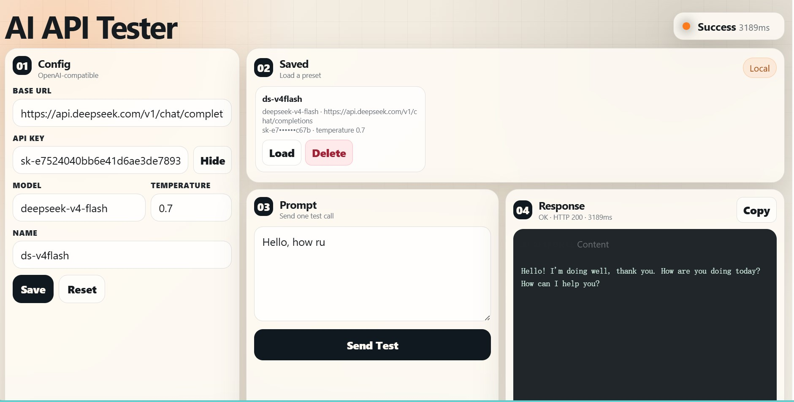

# AI API Tester

Quickly test whether an OpenAI-compatible AI API works by entering its API details. Everything runs locally in your browser, and no API keys or configuration data are stored in the cloud.

## Usage

1. Download the ZIP file and unzip it.
2. Drag `index.html` into your browser to open it.
3. Enter your AI API information and any prompt.
4. Click `Send Test` and check whether the AI returns a valid response.

Don't want to download it? You can <a href="https://tomuopc.github.io/ai-api-tester/">use it directly on the website</a>.

## Features

- Test OpenAI-compatible `/chat/completions` APIs
- Save API configurations to browser LocalStorage, then load or delete them
- View response text, raw JSON, timing, and errors without opening DevTools
- Built with plain HTML, CSS, and JavaScript

## Preview

